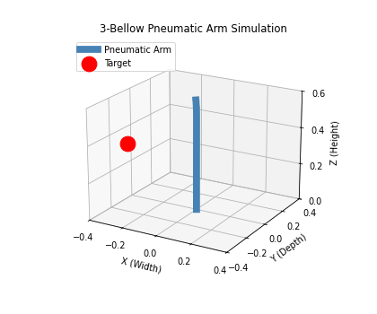
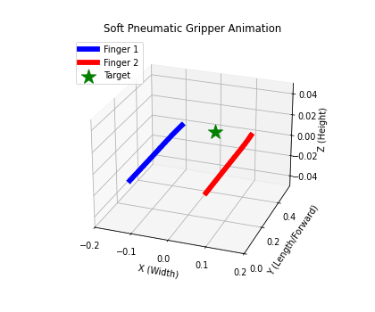

# Elastica-RL: RL Control of Soft Pneumatic Manipulators

PPO policies for two underactuated soft pneumatic robots, simulated as Cosserat rods in
[PyElastica](https://github.com/GazzolaLab/PyElastica):

- a three-bellow continuum trunk reaching to targets across its workspace
- a dual-finger gripper closing onto a target

<p align="center">
  
  
</p>

## Why a 1D simulator

Volumetric FEM (ANSYS, Abaqus) is accurate but far too slow to generate the millions of transitions
PPO needs, and is not differentiable. Cosserat rod theory collapses the 3D actuator to a 1D
centerline, bringing a 0.1 s control step down to milliseconds. 2M timesteps becomes an overnight
CPU job across 8 workers.

## Pressure to curvature

PyElastica has no fluidic chambers, so pressure is mapped to intrinsic rod curvature through a
trigonometric Jacobian from the PCC framework. The agent commands three chamber pressures rather
than the tip, which keeps the real robot's underactuation intact:

```
kappa_x = k_max * ( P1 - 0.5*P2 - 0.5*P3 )
kappa_y = k_max * ( sqrt(3)/2 * P2 - sqrt(3)/2 * P3 )
```

`k_max` bounds the curvature at full pressure and sets the reachable workspace.

Actions are clipped to non-negative pressure. In a `[-1, 1]` space a freshly initialized network
outputs ~0, which maps to half-inflating all three chambers at once. That is co-contraction: on
hardware it extends and stiffens the arm, and in a pure-bending 1D rod it collapsed the policy into
a locked state.

## Randomization

Three layers, resampled every episode:

- **Goal space**: target yaw over `[0, 2pi]`, curvature over `[0.2, 2.5] m^-1`, sampled across the
  true kinematic workspace. The agent has to learn a continuous inverse kinematics mapping instead
  of memorizing trajectories, which is what prevents directional mode collapse.
- **Dynamics**: Young's modulus +/-20%, damping +/-50%, covering silicone batch variation and
  material degradation.
- **Domain**: pneumatic latency as a low-pass filter on commanded pressure,
  `P = (1-a)*P + a*P_target`, `a` sampled from `[0.4, 1.0]`. Real air lines lag; standard Cosserat
  actuation assumes bending moments apply instantly. Current pressure is part of the observation,
  which keeps the problem Markovian under the filter.

## What randomization changes

Across 50 episodes drawn from the same randomization ranges used in training:

| | success within 5 cm | mean tip error |
| --- | --- | --- |
| Trunk, trained without randomization | 58% | 6.5 cm (10.8% of length) |
| Trunk, randomized | 92% | 2.4 cm (4.0%) |
| Gripper, randomized | 100% | 0.8 cm (1.6%) |

The randomized trunk needs roughly 2M timesteps for the critic to stabilize against the stochastic
physics, and converges to conservative braking that holds whether the episode draws a stiff rod
with sluggish air or a compliant rod with instant air.

## Rewards

- Trunk: potential shaping on change in tip-target distance, an absolute distance penalty, a
  distance-scaled bonus inside a 5 cm zone, and a tip-velocity penalty for braking.
- Gripper: summed fingertip distances, precision bonus, a symmetry penalty on `|x1 + x2|` to keep
  the grasp centered, velocity damping, and a hard cross-over penalty so the two rods stay out of
  non-physical overlap without a contact model.

## Layout

```
envs/pneumatic_arm_env.py    3-bellow trunk, 12D obs, 3D action
envs/soft_gripper_env.py     dual-finger gripper, 15D obs, 2D action
encoder.py                   shared MLP feature extractor
train_elephant_trunk.py      PPO, 8 SubprocVecEnv workers, VecNormalize
train_gripper.py
evaluate_*.py                deterministic rollout + 3D animation
eval_stats.py                success rate and tip error over N episodes
```

Trunk observation is tip position, target error vector, tip velocity, and chamber pressures.
Episodes run 100 control steps (10 simulated seconds) at dt = 1e-4.

## Running

```bash
uv sync
uv run train_elephant_trunk.py
uv run evaluate_elephant_trunk.py runs/trunk/run_<timestamp> --save demo/trunk.gif
uv run eval_stats.py trunk runs/trunk/run_<timestamp> --episodes 50
tensorboard --logdir runs/
```

`VecNormalize` statistics save next to each checkpoint and are needed at evaluation time.